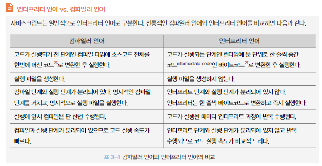
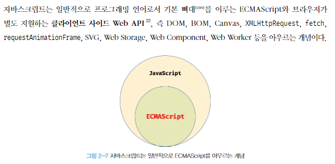

# 2. 자바스크립트란?

**2-1. 탄생**

넷스케이프 커뮤니케이션즈 웹페이지의 보조적인 기능을 수행하기 위해 브라우저에서 동작하는 경량 프로그래밍 언어를 도입하려 브랜던 아이크가 개발.

1996년 3월 모카로 명명되어 넷스케이프 내비게이터2에 탑재되었고 9월 라이브스크립트로 이름이 바뀌었다가 12월에 자바스크립트라는 이름으로 최종 명명됨.

**2-2. 표준화**

크로스 브라우징 이슈로 넷스케이프 커뮤니케이션즈는 컴퓨터 시스템의 표준을 관리하는 비영리 표준화 기구인 ECMA 인터내셔널에 자바스크립트의 표준화를 요청하였고 표준화된 자바스크립트인  ECMAScript를 발표하였다.

2015년에 공개된 ECMA6가 키워드, 화살표 함수, 클래스, 모듈 등과 같이 범용 프로그래밍 언어로서 갖춰야 할 기능들을 대거 도입하는 큰 변화가 있었으며 이후에는 비교적 작은 기능을 추가하는 수준으로 매년 공개할 것으로 예고되었다.

**2-3. 자바스크립트 성장의 역사**

초기의 자바스크립트는 html과 css를 단순히 렌더링 하는데에 그쳤으나 Ajax등이 등장하면서 서버에서 처리하던 일을 일부 프론트단에서 실행할 수 있게 되었다.

### 2.3.1 Ajax

1999년 서버와 브라우저가 비동기방식으로 데이터를 교환할 수 있는 통신 기능인 Ajax가 XMLHttpRequest라는 이름으로 등장했다.

기존에는 하나의 데이터가 바뀌면 필요없는 부분까지 전체 재 렌더링 해야 하기 때문에 성능 면에서도 불리했고 화면이 전환되면 화면이 순간적으로 깜빡이는 현상이 발생했는데 Ajax의 등장은 이를 바꾸어 놓았다.

즉, 웹페이지에서 변경하지 않아도 되는 부분은 재렌더링 하지 않고, 서버로부터 필요한 데이터만 전송받아 변경해야 하는 부분만 한정적으로 렌더링하는 방식이 가능해졌다.

2005년 구글이 발표한 구글 맵스는 JS와 Ajax를 기반으로 하는데 데스크톱 애플리케이션과 비교했을 때 성능과 부드러운 화면 전환 효과를 보여주었다.

### 2.3.2 JQuery

2006년 jQuery의 등장으로 DOM을 더욱 쉽게 제어할 수 있게 되었다. 자바스크립트보다 배우기 쉽고 직관적이기 떄문이다.

### 2.3.3 V8 자바스크립트 엔진

구글 맵스등 자바스크립트로 웹 애플리케이션을 구축하려는 시도가 늘면서 더욱 빠르게 동작하는 자바스크립트 엔진이 필요해 졌는데 구글은 V8을 개발해냈다. 데스크톱 애플리케이션과 같은 빠른 성능으로 자바스크립트를 웹 애플리케이션 프로그래밍 언어로 정착시켰다.

### 2.3.4 Node.js

브라우저의 자바스크립트 엔진에서만 동작하던 자바스크립트를 브라우저 이외의 환경에서도 동작할 수 있도록 자바스크립트 엔진을 브라우저에서 독립시킨 자바스크립트 실행 환경이다. Node.js는 다양한 플랫폼에 적용할 수 있지만 서버 사이드 애플리케이션 개발에 주로 사용되며, 이에 필요한 모듈, 파일 시스템, HTTP등 빌트인 API를 제공한다.

Node.js는 비동기 I/O를 지원하며 단일 스레드 이벤트 루프 기반으로 동작하므로 요청 처리 성능이 좋다. 그래서 데이터를 실시간으로 처리하기 위해 I/O가 빈번하게 발생하는 SPA에 적합하지만 CPU 사용률이 높은 앱에는 권장하지 않는다.

Node.js의 등장으로 백엔드 영역까지 개발을 할수 있게 되었다. 하이브리드 웹, 서버사이드, 데스크톱, 머신러닝, 로보틱스 등등의 언어로 많이 사용되고 있다

### 2.3.5 SPA

웹 애플리케이션이 데스크톱 앱과 비교해도 손색없는 성능과 UX를 요구하다 보니 개발 규모와 복잡도가 높아졌는데 이를 더 쉽게 개발하기 위해 많은 패턴과 라이브러리가 등장했다. CBD(컴포넌트베이스)방법론을 기반으로 하는 SPA가 대중화되면서 Angular, React, Vue.js, Svelte등 다양한 SPA프레임워크/라이브러리 또한 많은 사용층을 확보하고 있다.

### 2.4 자바스크립트와 ECMAScript

ECMAScript는 자바스크립트의 표준사양인 ECMA-262를 말하고 프로그래밍 언어의 값, 타입, 객체와 프로퍼티, 함수, 표준 빌트인 객체 등 핵심 문법을 규정한다. 각 브라우저 제조사는 이 사양을 준수하여 브라우저에 내장되는 자바스크립트 엔진을 구현한다.  

### 2.5 자바스크립트의 특징

자바스크립트는 html, css와 함께 웹을 구성하며 웹 브라우저에서 동작하는 유일한 프로그래밍 언어이다. 자바스크립트는 여러 기존의 프로그래밍 언어에서 많은 영향을 받았으며 이는 인터프리터 언어로 JS를 개발하는데 영향을 주었다. 대부분 모던 자바스크립트 엔진은 인터프리터와 컴파일러의 장점을 결합해 비교적 처리속도가 느린 인터프리터의 단점을 해결했다. 인터프리터는 소스코드를 즉시 실행하고 컴파일러는 빠르게 동작하는 머신 코드를 생성하고 최적화한다. 이를 통해 컴파일 단계에서 추가적인 시간이 필요함에도 더욱 빠르게 코드를 실행할 수 있다.

하지만 대부분의 모던 브라우저에서 사용되는 인터프리터는 전통적인 컴파일러 언어처럼 명시적인 컴파일 단계를 거치지는 않지만 복잡한 과정을 거치며 일부 소스코드를 컴파일하고 실행한다.

이를 통해 인터프리터 언어의 장점인 동적 기능 지원을 살리면서 실행 속도가 느리다는 단점을 극복한다. 따라서 현재는 컴파일러와 인터프리터의 기술적 구분이 점차 모호해져 가는 추세다. 하지만 자바스크립트는 런타임에 컴파일되며 실행 파일이 생성되지 않고 인터프리터 도움 없이 실행할 수 없기 때문에 컴파일러 언어라고는 할 수 없다.

자바스크립트는 명령형, 함수형, 프로토타입 기반 객체지향 프로그래밍을 지원하는 멀티 패러다임 프로그래밍 언어이다.

비록 다른 객체지향 언어와의 차이점에 대한 논쟁이 있긴 하지만 자바스크립트는 강력한 객체지향 프로그래밍 능력을 가지고 있다. 간혹 클래스 ,상속, 정보 은닉을 위한 키워드가 없어서 객체지향 언어가 아니라고 오해하는 경우도 있지만 자바스크립트는 클래스 기반 객체지향 언어보다 효울적이면서 강력한 **프로토타입 기반의 객체지향 언어**이다.

### 2.6 ES6 브라우저 지원 현황

인터넷 익스플로러를 제외한 대부분의 모던 브라우저는 ES6을 지원하지만 100%는 아님. ES6 지원 현황은 [https://kangax.github.io/compat-table/es6](https://kangax.github.io/compat-table/es6) 에서 확인할 수 있다.