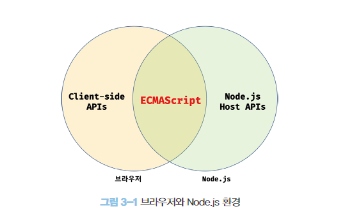
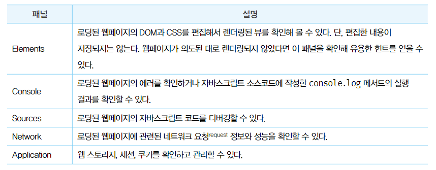
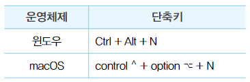

# 3. 자바스크립트 개발 환경과 실행 방법

### 3.1 자바스크립트 실행환경

웹에서의 JS는 HTML, CSS, 자바스크립트를 실행해 웹페이지를 브라우저 화면에 렌더링하는 것이 주된 목적이지만 Node.js는 브라우저 외부에서 자바스크립트 실행 환경을 제공하는 것이 주된 목적이므로 둘다 JS의 코어인 ECMAScript를 실행할 수 있지만 브라우저와 Node.js에서 ECMAScript 이외에 추가로 제공하는 기능은 호환되지 않는다.

예를들어  브라우저는 DOM API를 기본적으로 제공하지만 Node.js는 제공하지 않는다. Node.js에서는 alert를 단독으로 실행할 수 없다.(alert는 브라우저 DOM 조작 함수이기 때문)



**3.2 웹 브라우저**

크롬(65.47) > 사파리(16.97) 의 웹 브라우저 점유율

**3.2.1 개발자 도구**

웹 개발에 유용한 기능들을 제공함



**3.2.2 콘솔**

**3.2.3 브라우저에서 자바스크립트 실행**

**3.2.4 디버깅**

source 탭에서 소스코드를 열어 왼쪽의 라인번호를 클릭해 중단점을 걸어 디버깅 할 수 있다.

### 3.3 Node.js

클라이언트 사이드(브라우저에서 동작하는 간단한 웹 애플리케이션) 앱은 브라우저만으로 개발할수 있지만 프로젝트 규모가 커짐에 따라 React, Angular, Lodash같은 프레임워크 또는 라이브러리를 도입하고나 Babel, Webpack, ESLint등 여러가지 도구를 사용하게 되는데 이떄 Node.js와 npm이 필요하다.

**3.3.1 Node.js와 npm 소개**

- Node.js는 2009년 라이언 딜이 발표한 크롬 V8 자바스크립트 에진으로 빌드된 자바스크립트 런타임 환경이다. 브라우저에서만 동작하던 자바스크립트를 브라우저 이외의 환경에서 동작시킬 수 있다
- npm은 자바스크립트 패키지 매니저로 Node.js에서 사용할 수 있는 모듈들을 패키지화해서 모아둔 저장소 역할과 패키지 설치 및 관리를 위한 CLI를 제공한다.

**3.3.2 Node.js 설치**

```html
$ node -v
$ npm -v
```

로 설치 후 버전을 확인할 수 있다.

### 3.3.3 Node.js REPL

Node.js가 제공하는 Read Eval Print Loop를 사용하면 간단한 자바스크립트 코드를 실행해 결과를 확인할 수 있다.

### 3.4 비주얼 스튜디오 코드

**3.4.1 비주얼 스튜디오 코드 설치**

**3.4.2 내장 터미널**

**3.4.3 Code Runner 확장 플러그인**

Code Runner 확장 플러그인은 지금 실행중인 코드를 단축키만으로 실행시킬 수 있다.



단 Code Runner는 Node.js 환경을 이용해 자바스크립트를 실행하므로 Web API인 alert함수를 동작시킬 수 없다. 클라이언트 사이드 Web API가 포함된 소스코드는 브라우저 환경에서 실행해야한다.

**3.4.4 Live Server 확장 플러그인**

소스코드 수정사항을 바로 반영해 주는 플러그인