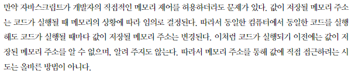
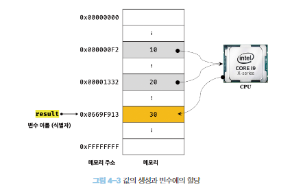
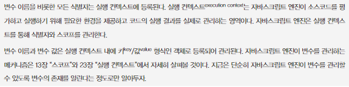
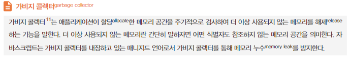
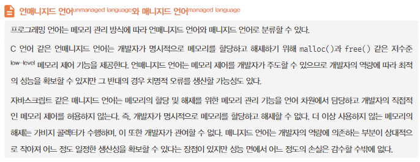
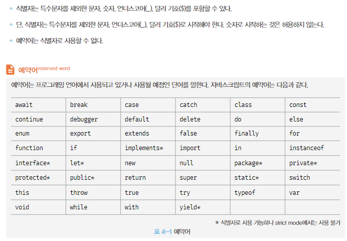

# 4. 변수

### 4.1 변수란 무엇인가? 왜 필요한가?

변수는 프로그래밍 언어에서 데이터를 관리하기 위한 핵심 개념이다

```html
10 + 20
```

10+20을 계산하기 위해서는 자바스크립트는 숫자를 알아야하고 + 기호를 알아야 한다. 우리는 두뇌에서 계산과 기억을 하지만 컴퓨터는 연산과 기억을 수행하는 부품이 나뉘어져있다. 컴퓨터는 CPU를 사용해 연산을 하고, 메모리를 사용해 데이터를 기억한다.

메모리는 데이터를 저장할 수 있는 메모리 셀의 집합체로 셀 하나의 크기는 1바이트(8비트)이며 컴퓨터는 메모리 셀의 크기인 1바이트 단위로 데이터를 저장하거나 읽는다.

각 메모리셀은 고유의 메모리 주소를 갖는데 이는 메모리 공간의 위치를 나타낸다. 0부터 시작해서 메모리의 크기만큼 정수로 표현된다. 예를 들어, 4GB 메모리는 0부터 4,294,967,295(0x00000000 ~ 0xFFFFFFFF) 까지의 메모리 주소를 가진다.

컴퓨터는 모든 데이터를 2진수로 처리하기 때문에 메모리 저장되는 데이터는 종류에 상관없이 모두 2진수로 저장된다

위 예제는 10, 20 각각 다른 셀에 저장되고 연산한 결과인 30도 메모리 상의 임의의 위치에 저장된다. 

이제 CPU 연산 결과인 30을 사용하기 위해서 메모리 공간에 직접 접근해야 한다. 하지만 메모리 주소를 통해 값에 직접 접근하는 것은 치명적 오류를 발생시킬 가능성이 매우 높은 위험한 일이기 때문에 자바스크립트는 개발자의 직접적인 메모리 제어를 허용하지 않는다. 



프로그래밍 언어는 기억하고 싶은 값을 메모리에 저장하고, 저장된 값을 읽어들여 재사용하기 위해 변수라는 매커니즘을 제공한다. 변수란 하나의 값을 저장하기 위해 확보한 메모리 공간 자체 또는 그 메모리 공간을 식별하기 위해 붙인 이름을 말한다.

즉 변수는 프로그래밍 언어에서 값을 저장하고 참조하는 매커니즘으로, 값의 위치를 가리키는 상징적인 이름이다. 상징적 이름인 변수는 프로그래밍 언어의 컴파일러 또는 인터프리터에 의해 값이 저장된 메모리 공간의 주소로 치환되어 실행된다. 따라서 개발자가 직접 메모리 주소를 통해 값을 저장하고  참조할 필요가 없고 변수를 통해 안전하게 값에 접근할 수 있다.

```html
var result = 10 + 20;
```

10+20연산은 새로운 값 30을 생성하고, 이는 메모리 공간에 저장된다. 이때 메모리 공간에 저장된 값 30을 다시 읽어 들여 재사용할 수 있도록 값이 저장된 메모리 공간에 상징적인 이름을 붙인 것이 변수이다.



메모리 공간의 고유한 이름 : 변수 이름(명)

변수에 저장된 값 : 변수 값

변수에 값을 저장하는 것 : 할당(대입, 저장)

변수명은 상징적인 이름으로 저장된 값의 의미를 파악할 수 있는것이므로 가독성을 높이는 부수적인 효과가 있어 변수이름은 잘 지어야 한다.

### 4.2 식별자

변수이름, 어떤 값을 구별해서 식별할 수 있는 고유한 이름.

식별자는 값이 아니라 메모리 주소를 기억하고 있다. 즉 식별자로 값을 구별해서 식별한다는 것은 식별자가 기억하고 있는 메모리 주소를 통해 메모리 공간에 저장된 값에 접근할 수 있다는 의미이다. 식별자는 메모리 주소에 붙인 이름이라고 할 수 있다.

식별자는 변수 이름에만 국한되어 사용되는 것이 아니며 메모리 상에 존재하는 어떤 값을 식별할 수 있는 이름(변수, 함수, 클래스 등의 이름)은 모두 식별자라고 부른다.

변수, 함수, 클래스 등의 이름과 같은 식별자는 네이밍 규칙을 준수해야 하며 선언에 의해 자바스크립트 엔진에 식별자의 존재를 알린다.

### 4.3 변수 선언

변수 선언이란 변수를 생성하는 것이다. 값을 저장하기 이한 메모리 공간을 확보하고 변수 이름과 확보된 메모리 공간의 주소를 연결해서 값을 저장할 수 있게 준비하는 것이다. 변수 선언에 의해 확보된 메모리 공가은 확보가 해제 되기 전까지는 누구도 확보된 메모리 공간을 사용할 수 없도록 보호되므로 안전하게 사용할 수 있다.

변수를 사용하려면 반드시 선언이 필요하다. JS 변수선언은 var, let, const 키워드를 사용한다.

자바스크립트는 변수를 선언하고 값을 할당하지 않았을 때 엔진에 의해 undefined라는 값이 암묵적으로 할당되어 초기화 된다.

자바스크립트 엔진은 선언단계 → 초기화 단계 2단계로 수행된다.

- 변수 이름은 어디에 등록되는가?
  
    
    

var 변수선언은 선언과 초기화가 동시에 진행된다. 선언단계로 변수 이름 score를 등록하고, 초기화로 변수에 암묵적으로 undefined를 할당해 초기화한다.

만약 초기화단계를 거치지 않으면 확보된 메모리 공간에는 이전에 다른 애플리케이션이 사용했던 값이 남아 있을 수 있다. 이를 쓰레기값(garbage value)라고 하는데 var는 암묵적으로 초기화를 수행해 이러한 위험으로부터 안전하다.

선언하지 않은 식별자에 접근하면 ReferenceError(참조에러)가 발생하므로 변수를 사용하려면 반드시 선언이 필요하다.

### 4.4 변수 선언의 실행 시점과 변수 호이스팅

```jsx
console.log(score);
var score;
```

변수 선언문보다 변수를 참조하는 코드가 먼저 쓰여 있고, 자바스크립트 코드는 인터프리터에 의해 한 줄씩 순차 실행되므로 참조에러가 발생할 것으로 예상되지만 undefined가 출력된다.

**이유는 변수 선언이 소스코드가 한 줄씩 순차적으로 실행되는 시점, 즉 런타임이 아니라 그 이전단계에서 먼저 실행되기 때문이다.**

자바스크립트 엔진은 소스코드를 한 줄씩 실행하기 전 평가과정을 거치는데 이는 변수 선언을 포함한 모든 선언문(변수, 함수 선언문등)을 소스코드에서 찾아내 먼저 실행하기 때문이다.

즉 변수 선언이 소스코드에 어디에 있든 상관없이 다른 코드보다 먼저 실행되므로 변수 선언이 어디에 위치하는가와 상관 없이 변수 참조가 가능하며 이는 변수 호이스팅이라고 불린다. 

***호이스팅** 변수 선언이 소스코드가 순차적으로 실행되는 런타임 이전 단계에서 먼저 실행된다는 증거이고 이처럼 변수 선언문이 코드의 선두로 끌어 올려진 것처럼 동작하는 자바스크립트 고유의 특징

### 4.5 값의 할당

변수에 값을 할당할 때는 할당연산자인 = 를 사용한다. 우변의 값을 좌변의 변수에 할당한다.

```jsx
// 선언 후 할당
var score;
score = 80;

// 선언과 할당을 동시에
var scire = 80;
```

자바스크립트 엔진은 선언과 할당을 동시에 하더라도 1번 경우처럼 선언과 할당을 나누어서 동작한다. 이때 주의할 점은 변수 선언과 값의 할당의 실행 시점이 다르다는 것이다. **변수 선언은 소스코드가 순차적으로 실행되는 시점인 런타임 이전에 먼저 실행되지만 값의 할당은 소스코드가 순차적으로 실행되는 런타임에 실행된다.**

```jsx
console.log(score); // undefined
var score;
score = 80;

console.log(score); // 80
```

```jsx
console.log(score); // undefined
score = 80;
var score;
console.log(score); // 80
```

### 4.6 값의 재할당

var는 선언한 변수의 값을 재할당 할 수 있다. 재할당이란 현재 변수에 저장된 값을 버리고 새로운  값을 저장하는 것이다. var 키워드로 선언한 변수는 선언과 동시에 undefined로 초기화 되기 때문에 엄밀히 말하자면 변수에 처음으로 값을 할당하는 것도 사실은 재할당이다.

만약 값을 재할당할 수 없어서 변수에 저장된 값을 변경할 수 없다면 변수가 아니라 상수라  한다. 상수는 한번 정해지면 변하지 않는 값이고 단 한번만 할당할 수 있는 변수다(const)

***const** 재할당을 하게 되면 Uncaught TypeError: Assignment to constant variable 에러가 발생한다.

변수에 값을 재할당하면 score변수의 값은 이전 값 80에서 90으로 변경된다. 재할당은 80이 있던 메모리 공간을 지우고 그 메모리 공간에 재할당 값 90을 새롭게 저장하는 것이 아니라 새로운 메모리 공간을 확보하고 그 메모리 공간에 숫자 값 90을 저장한다.

80처럼 더이상 불필요한 값들은 가비지 콜렉터에 의해 메모리에서 자동 해제된다. 단, 메모리에서 언제 해제될지는 예측할 수 없다.

- 가비지 콜렉터
  
    
    
- 언매니지드언어 와 매니지드언어
  
    
    

### 4.7 식별자 네이밍 규칙

