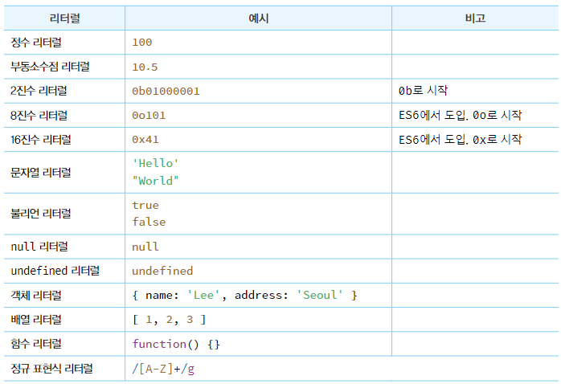
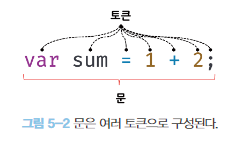

# 5. 표현식과 문

### 5.1 값

값은 식(표현식)이 평가되어 생성된 결과를 말한다. 즉 10 + 20의 결과인 30을 말함.

### 5.2 리터럴

리터럴은 사람이 이해할 수 있는 문자 또는 약속된 기호를 사용해 값을 생성하는 표기법을 말한다.

3은 단순히 아라비아 숫자가 아니라 숫자 리터럴이다. 사람이 이해할 수 있는 아라비아 숫자를 사용해 숫자 리터럴 3을 코드에 기술하면 자바스크립트 엔진은 이를 평가해 숫자 값 3을 생성한다.

**다양한 리터럴**



### 5.3 표현식

표현식은 값으로 평가될 수 있는 문statement이다. 즉 표현식이 평가되면 새로운 값을 생성하거나 기존 값을 참조한다.

### 5.4 문

문은 프로그램을 구성하는 기본 단위이자 최소 실행 단위이다. 문의 집합으로 이루어진 것이 프로그램이며 문을 작성하고 순서에 맞게 나열하는 것이 프로그래밍이다.

문은 여러 토큰으로 구성되는데 토큰이란 문법적인 의미를 가지며 문법적으로 더 이상 나눌 수 없는 코드의 기본 요소를 의미한다. 예를들어 키워드 ,식별자, 연산자, 리터럴, 세미콜론이나 마침표 등의 특수 기호는 문법적인 의미를 가지며, 문법적으로 더 이상 나눌 수 없는 코드의 기본 요소이므로 모두 토큰이다.



문은 명령문으로도 불리는데 컴퓨터에 내리는 명령문이기 때문이다. 문은 선언문, 할당문, 조건문, 반복문 등으로 구분할 수 있고 변수 선언문을 실행하면 변수가 선언되고, 할당문을 실행하면 값이 할당된다. 조건문을 실행하면 지정한 조건에 따라 실행할 코드 블록이 결정되어 실행되고, 반목문을 실행하면 특정코드 블록이 반복 실행된다.

```jsx
// 변수 선언문
var x;

// 할당문
x = 5;

// 함수 선언문
function foo () {}

// 조건문
if (x > 1) { console.log(x); }

// 반복문
for (var i = 0; i < 2; i++) { console.log(i); }
```

### 5.5 세미콜론과 세미콜론 자동 삽입 기능

세미콜론은 문의 종료를 나타낸다. 단 0개 이상의 문을 중괄호로 묶은  코드블록 뒤에는 세미콜론을 붙이지 않는다.(if, for, 함수 등)

세미콜론은 생략 가능하며 이 이유는 자바스크립트 엔진이 소스코드를 해석할 때 문의 끝이라고 예측되는 지점에 세미콜론을 자동으로 붙여주는 세미콜론 자동 삽입기능이 암묵적으로 수행되기 때문이다.

하지만 간혹 동작과 개발자의 의도가 일치하지 않는 경우가 있다.

```jsx
function foo () {
	return
		{}
	// ASI의 동작 결과 => return; {};
	// 개발자의 예측 => return {};
}
console.log(foo()); // undefined

var bar = function () {}
(function() {})();
// ASI의 동작 결과 => var bar = function () {}(function() {})();
// 개발자의 예측 => var bar = function () {}; (function() {})();
// TypeError: (intermediate value)(...) is not a function
```

많은 곳에서 세미콜론 사용을 권장하는 분위기 이므로 세미콜론을 붙이는 걸 추천한다.

### 5.6 표현식인 문과 표현식이 아닌 문

표현식은 문의 일부일 수도 있고 그 자체로 문이 될 수도 있다.

```jsx
// 변수 선언문은 값으로 평가될 수 없으므로 표현식이 아니다.
var x;
// 1, 2, 1 + 2, x = 1 + 2는 모두 표현식이다.
// x = 1 + 2는 표현식이면서 완전한 문이기도 하다.
x = 1 + 2;
```

표현식을 구별하는 방법은 변수에 할당 해 보는 것이다. 표현식인 문은 값으로 평가되므로 변수에 할당할 수 있다. 하지만 표현식이 아닌 문은 값으로 평가할 수 없으므로 변수에 할당하면 에러가  발생한다..

```jsx
var foo = var x ; // SyntacError: Unexpected token var

// 변수 선언문은 표현식이 아닌 문이다.
var x;

// 할당문은 그 자체가 표현식이지만 완전한 문이기도 하다.
// 즉 할당문은 표현식인 문이다.
x = 100;

// 표현식인 문은 값처럼 사용할 수 있다.
var foo = x = 100;
```