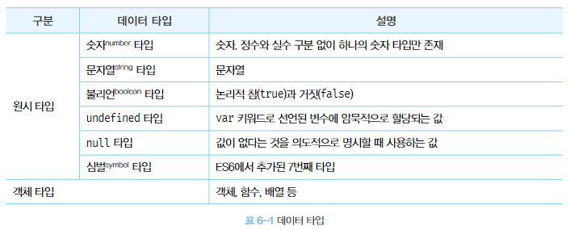
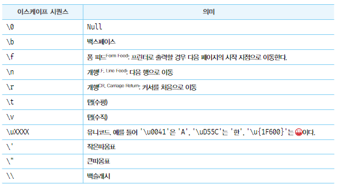
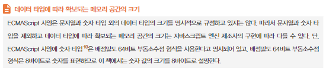

# 6. 데이터 타입

자바스크립트(ES6)는 7개의 데이터 타입을 제공한다. 7개의 데이터 타입은 원시타입과primitive type과 객체타입object/reference type으로 분류할 수 있다.



‘1’ 과 1은 값을 생성한 목적과 용도가 다르고 전혀 다른 값이다. 이처럼 개발자는 명확한 의도를 가지고 타입을 구별해서 값을 생성할 것이고, 자바스크립트 엔진은 타입을 구별해서 값을 취급할 것이다.

### 6.1 숫자 타입

하나의 숫자 타입만 존재하며 숫자 타입의 값은 배정밀도 64비트 부동소수점 형식을 따른다. 즉 모든 수를 실수로 처리하며 정수만 표현하기 위한 데이터 타입이 별도로 존재하지 않는다.

또한 2, 8, 16진수등을 표현하기 위한 데이터 타입을 제공하지 않으므로 이들의 값을 참조하면 모두 10진수로 해석된다.

모든 수를 실수로 처리하기 때문에 정수로 표기되는 수 끼리 나누더라도 실수가 나올 수 있고 1 === 1.0이 true이다.

- Infinity : 양의 무한대
- -Infinity : 음의 무한대
- NaN ; 산술 연산 불가(not-a-number)

를 표현할 수 있다. 대소문자를 구별하므로 Nan, nan과 같이 표현하면 에러가 나거나 식별자로 인식된다.

### 6.2 문자열 타입

0개 이상의 16비트 유니코드 문자(UTF-16)의 집합으로 전 세계 대부분의 문자를 표현할 수 있다. 작은따옴표, 큰따옴표, 백틱으로 텍스트를 감싸며 가장 일반적인 표기법은 작은 따옴표 사용이다.

문자열을 따옴표로 감싸는 이유는 키워드나 식별자 같은 토큰과 구분하기 위해서 이다. 또한 따옴표로 문자열을 감싸지 않는다면 공백 문자도 포함 시킬 수 없기 때문이다.

### 6.3 템플릿 리터럴

템플릿 리터럴은 멀티라인 문자열, 표현식 삽입, 태그드 탬플릿 등 편리한 문자열 처리 기능을 제공한다. 템플릿 리터럴은 런타임에 일반 문자열로 변환되어 처리된다. 백틱을 사용해 표현된다.

**6.3.1 멀티라인 문자열**

일반 문자열 내에서는 줄바꿈(개행)이 허용되지 않는다.

```jsx
var str = 'Hello
world.';
// SyntaxError: Invalid or unexpected token
```

따라서 일반 문자열 내에서 줄바꿈 등의 공백을 표현하려면 백슬래시로 시작하는 이스케이프 시퀀스를 사용해야 한다.



```jsx
var template = '<ul>\n\t<li><a href="#">Home</a></li>\n</ul>';
cosole.log(template);

// <ul>
//    <li><a href="#">Home</a></li>
// </ul>
```

**6.3.2 표현식 삽입**

문자열은 문자열 연산자 + 를 사용해 연결 할 수 있다. + 연산자는 피연산자 중 하나 이상이 문자열인 경우 문자열 연결 연산자로 동작한다. 외의 경우에는 덧셈 연산자로 동작한다

```jsx
var first = 'Ung-mo';
var last = 'Lee';

// ES5: 문자열 연결
console.log('My name is' + first + ' ' + last + '.');
// My name is Ung-mo Lee.
```

템플릿 리터럴 내에서는 표현식 삽입을 통해 간단히 문자열을 삽입할 수 있다. 이를 통해 문자열 연산자보다 가독성 좋고 간편하게 문자열을 조합할 수 있다.

```jsx
var first = 'Ung-mo';
var last = 'Lee';

// ES6: 표현식 삽입
console.log(`My name is ${first} ${last}.`);
// My name is Ung-mo Lee.
```

표현식 삽입은 ${}로 감싸서 가능한데 표현식의 결과가 문자열이 아니더라도 문자열로  타입이 강제로 변환되어 삽입된다. 또한 템플릿 리터럴 내에서 삽입해야 하는데 일반 문자열에서의 표현식 삽입은 문자열로 취급된다.

```jsx
console.log(`1 + 2 = ${1+2}`); // 1 + 2 = 3
console.log('1 + 2 = ${1+2}'); // 1 + 2 = ${1+2}
```

### 6.4 불리언 타입

논리적 참, 거짓을 나타내는 true와 false

불리언 타입의 값은 참과 거짓으로 구분되는 조건에 의해 프로그램의 흐름을 제어하는 조건문에서 자주 사용한다. 8.2절 조건문에서 다시 다룬다

### 6.5 undefined 타입

var 키워드로 선언한 변수가 암묵적으로 초기화 되는 타입이다. 변수 선언에 의해 확보된 메모리 공간을 처음 할당이 이뤄질 때까지 빈 상태(대부분 비어있지 않고쓰레기 값이 들어 있음)로 내버려 두지 않고 자바스크립트 엔진이 undefined로 초기화한다. 따라서 변수를 선언한 이후 값을 할당하지 않은 변수의 참조값은 undefined이다.

undefined는 개발자가 의도적으로 할당하기 위한 값이 아니라 자바스크립트 엔진이 변수를 초기화 할 때 사용하는 값이다. 즉 변수를 참조했을 때 반환되는 값에 따라 초기화 되어있는지 여부를 알 수 있다. 

개발자가 의도적으로 변수에 undefined를 할당하는것은 본래 취지에 어긋날 뿐더러 혼란을 줄 수 있으므로 권장하지 않는다.

### 6.6 null 타입

변수에 값이 없다는 것을 의도적으로 명시하고 싶을 때 쓰는 타입. 자바스크립트는 대소문자를 구별하므로 null은 Null, NULL과는 다르다.

변수에 null을 할당하는 것은 변수가 이전에 참조하던 값을 더 이상 참조하지 않겠다는 의미이다. 이는 이전에 할당되어 있던 값에 대한 참조를 명시적으로 제거하는 것을 의미하며, 자바스크립트 엔진은 누구도 참조하지 않는 메모리 공간에 대해 가비지 콜렉션을 수행할 것이다.

```jsx
var foo = 'Lee';
foo = null;

// 이전 참조를 제거, foo 변수는 더 이상 'Lee'를 참조하지 않는다.
// 유용해 보이지는 않는다. 변수의 스코프를 좁게 만들어 변수 자체를 재빨리
// 소멸시키는 편이 낫다.
```

함수가 유효한 값을 반환할 수 없는 경우 명시적으로 null을 반환하기도 한다. 예를 들어, HTML 요소를 검색해 반환하는 document.querySelector 메서드는 조건에 부합하는 HTML 요소를 검색할 수 없는 경우 에러 대신 null을 반환한다.

```jsx
var element = document.querySelector('.myClass');
console.log(element); // null
```

### 6.7 심벌 타입

심벌은 ES6에서 추가된 7번째 타입으로, 변경 불가능한 원시 타입의 값이다. 심벌 값은 다른 값과 중복 되지 않는 유일무이한 값이다. 따라서 주로 이름이 충돌할 위험이 없는 객체의 유일한 프로퍼티 키를 만들기 위해 사용한다.

심벌 이외의 원시 값은 리터럴을 통해 생성하지만 심벌은 Symbol 함수를 호출해 생성한다. 이때 생성된 심벌 값은 외부에 노출되지 않으며, 다른 값과 절대 중복되지 않는 유일무이한 값이다.

```jsx
// 심벌 값 생성
var key = Symbol('key');
console.log(typeof key); // symbol

// 객체 생성
var obj = {};

// 이름이 충돌할 위험이 없는 유일무이한 값인 심벌을 프로퍼티 키로 사용한다.
obj[key] = 'value';
console.log(obj[key]); // value
```

추후 33장 “7번째 타입 Symbol”에서 다시 다룰 예정이다.

### 6.8 객체 타입

자바스크립트의 데이터 타입은 크게 원시 타입과 객체 타입으로 분류한다. 이유는 둘이 근본적으로 다르기 때문이다. 객체는 추후 11장 “원시 값과 객체의 비교”에서 다시 다룬다.

중요한 것은 자바스크립트는 객체 기반의 언어이며, 자바스크립트를 이루고 있는 거의 모든 것이 객체라는 것이다. 지금까지 살펴본 6가지 데이터 타입(숫자, 문자, boolean, undefined, null) 이외의 값은 모두 객체 타입이다.

### 6.9 데이터 타입의 필요성

**6.9.1 데이터 타입에 의한 메모리 공간의 확보와 참조**

값은 메모리에 저장하고 참조할 수 있어야 한다. 메모리에 값을 저장하려면 먼저 확보해야할 메모리 공간의 크기를 정해야 하고 몇 바이트의 메모리 공간을 사용해야 낭비와 손실 없이 값을 저장할 수 있는지를 알아야 한다.

예를 들어 var score = 100; 코드가 실행 되었을 때 컴퓨터는 숫자 값 100을 저장하기 위해 메모리 공간을 확보한 다음, 확보된 메모리에 숫자 값 100을 2진수로 저장할 것이다. 이러한 처리를 하려면 숫자 값을 저장할 때 확보해야 할 메모리 공간의 크기를 알아야 한다. 자바스크립트 엔진은 데이터 타입, 즉 값의 종류에 따라 정해진 크기의 메모리 공간을 확보한다. = 변수에 할당되는 값의 데이터 타입에 따라 확보해야 할 메모리 크기가 결정된다.

위 예제는 100을 숫자타입의 값으로 해석하고 숫자타입 100을 저장하기 위해 8바이트의 메모리 공간을 확보할 것이다.



값을 참조할 때 식별자 score로 숫자 값 100이 저장되어 있는 메모리공간의 선두 메모리셀 주소를 찾아갈 수 있다. 한번에 읽어 들여야 할 메모리 셀 크기는 타입의 값 인식 → 숫자타입은 8바이트 단위로 저장 → 메모리셀 8개 읽어들임 순이다.

**6.9.2 데이터 타입에 의한 값의 해석**

메모리에서 읽어 들인 2진수는 값의 타입에 맞게 해석된다.

<aside>
💡 데이터 타입이 필요한 이유

- 값을 저장할 때 확보해야 하는 메모리 공간의 크기를 결정하기 위해
- 값을 참조할 때 한 번에 읽어 들여야 할 메모리 공간의 크기를 결정하기 위해
- 메모리에서 읽어 들인 2진수를 어떻게 해석할지 결정하기 위해
</aside>

### 6.10 동적 타이핑

자바스크립트의 모든 값은 데이터 타입을 갖는데 변수는 어떤 데이터 타입을 가질까?

**6.10.1 동적 타입 언어와 정적 타입 언어**

C나 자바같은 정적타입 언어는 변수를 선언할 때 변수에 할당할 수 있는 값의 종류, 즉 데이터 타입을 사전에 선언해야 하지만(명시적 타입 선언) 자바스크립트는 오직 var, let, const 키워드를 사용해 변수를 선언한다. 또한 미리 선언한 데이터타입의 값만 할당할 수 있는 것이 아니라 어떠한 데이터 타입의 값이라도 자유롭게 할당할 수 있다.

**6.10.2 동적 타입 언어와 변수**

동적 타입 언어는 어떤 데이터 타입의 값도 자유롭게 할당할 수 있다.

구조적인 단점

- 타입에 관계없이 값이 변해 변수 값을 추적하기 어렵다. → 값을 확인하기 전에는 타입을 확신할 수 없다.
- 자바스크립트 엔진에 의해 암묵적으로 타입이 변환되기도 한다.

동적 타입은 유연성은 높지만 신뢰성이 떨어진다. 이유로 안정적인 프로그램을 만들기 위해 변수를 사용하기 이전에 데이터 타입을 체크해야 하는 경우가 있는데 번거롭고 코드의 양도 증가한다.

**변수 사용시 주의사항**

- 꼭 필요한 경우에 한해 제한적으로 사용
- 변수의 유효 범위(스코프)는 최대한 좁게 만들어 변수 부작용을 억제
- 전역 변수 최대한 사용 자제
- 변수보다는 상수를 사용해 값의 변경을 억제
- 값이 바뀌어도 알아 챌 수 있도록 변수의 목적이나 의미를 파악할 수 있도록 네이밍