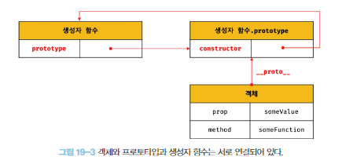

# 19. 프로토타입

명령형, 함수형, 프로토타입 기반, 객체지향 프로그래밍을 지원하는 멀티 패러다임 프로그래밍 언어

**자바스크립트는 객체 기반의 프로그래밍 언어이며 자바스크립트를 이루고 있는 거의 “모든 것”이 객체이다. (원시 타입을 제외하고 모든 것이 객체)**

### 19.1 객체지향 프로그래밍

객체지향 프로그래밍은 프로그램을 명령어 또는 함수의 목록으로 보는 전통적인 명령형 프로그래밍의 절차지향적 관점에서 벗어나 여러 개의 독립적 단위, 즉 객체의 집합으로 프로그램을 표현하려는 패러다임이다. 

실세계의 실체를 필요한 속성만 간추려 표현하는 추상화를 거치면 실체를 인식하거나 구별할 수 있다.

```jsx
// 이름과 주소 속성을 갖는 객체
const person = {
	name: 'Lee',
	address: 'Seoul'
};
console.log(person); // {name: "Lee", address: "Seoul"}
```

속성을 통해 여러 개의 값을 하나의 단위로 구성한 복합적인 자료구조를 객체라 하며, 객체지향 프로그래밍은 독립적인 객체의 집합으로 프로그램을 표현하려는 프로그래밍 패러다임이다.

예시로 원을 객체로 만들어보면 원의 반지름 속성을 가지고 원의 지름, 둘레, 넓이를 구할 수 있다. 이때 반지름은 원의 상태를 나타내는 데이터이며 원의 지름, 둘레, 넓이를 구하는 것은 동작이다.

이처럼 객체지향 프로그래밍은 객체의 상태state를 나타내는 데이터와 상태 데이터를 조작할 수 있는 동작behavior을 하나의 논리적인 단위로 묶어 생각한다. 따라서 **객체는 상태 데이터와 동작을 하나의 논리적인 단위로 묶은 복합적인 자료구조**라고 할 수 있다.

### 19.2 상속과 프로토타입

상속은 객체지향 프로그래밍의 핵심 개념으로 어떤 객체의 프로퍼티 또는 메서드를 다른 객체가 상속받아 그대로 사용할 수 있는 것을 말한다.

```jsx
// 생성자 함수
function Circle(radius) {
	this.radius = radius;
	this.getArea = function () {
		// Math.PI는 원주율 상수
		return Math.PI * this.radius ** 2;
	};
}

// 반지름이 1인 인스턴스 생성
const circle1 = new Circle(1);
// 반지름이 2인 인스턴스 생성
const circle2 = new Circle(2);

// Circle 생성자 함수는 인스턴스를 생성할 때마다 동일한 동작을 하는
// getArea 메서드를 중복 생성하고 모든 인스턴스가 중복 소유한다
// getArea 메서드는 하나만 생성하여 모든 인스턴스가 공유해서 사용하는 것이 바람직하다
console.log(circle1.getArea === circle2.getArea); // false

console.log(circle1.getArea()); // 3.141592653589793
console.log(circle2.getArea()); // 12.566370614359172
```

생성자 함수는 동일한 프로퍼티(메서드 포함) 구조를 갖는 객체를 여러 개 생성할 때 유용하다. 하지만 위 생성자 함수로 여러개 인스턴스를 생성한다면 내용이 동일한 메서드가 중복 생성되고 모든 인스턴스가 중복 소유한다.

이처럼 동일한 생성자 함수에 의해 생성된 모든 인스턴스가 동일한 메서드를 중복 소유하는 것은 메모리를 불필요하게 낭비하고 인스턴스를 생성할 때마다 메서드를 생성하므로 퍼포먼스에도 악영향을 준다. 상속을 통해 불필요한 중복을 제거할 수 있다. **자바스크립트는 프로토타입을 기반으로 상속을 구현한다.**

```jsx
// 생성자 함수
function Circle(radius) {
	this.radius = radius;
}

// Circle 생성자 함수가 생성한 모든 인스턴스가 getArea 메서드를
// 공유해서 사용할 수 있도록 프로토타입에 추가한다
// 프로토타입은 Circle 생성자 함수의 prototype 프로퍼티에 바인딩되어 있다
Circle.prototype.getArea = function () {
	return Math.PI * this.radius ** 2;
};

// 인스턴스 생성
const circle1 = new Circle(1);
const circle2 = new Circle(2);

// Circle 생성자 함수가 생성한 모든 인스턴스는 부모 객체의 역할을 하는
// 프로토타입 Circle.prototype으로부터 getArea 메서드를 상속받는다
// 즉, Circle 생성자 함수가 생성하는 모든 인스턴스는 하나의 getArea 메서드를 공유한다
console.log(circle1.getArea === circle2.getArea); // true

console.log(circle1.getArea()); // 3.141592653589793
console.log(circle2.getArea()); // 12.566370614359172
```

### 19.3 프로토타입 객체

프로토타입 객체(줄여서 프로토타입)란 객체지향 프로그래밍의 근간을 이루는 객체 간 상속을 구현하기 위해 사용된다. 프로토타입은 어떤 객체의 상위(부모) 객체의 역할을 하는 객체로서 다른 객체에 공유 프로퍼티(메서드 포함)를 제공한다. 프로토타입을 상속받은 하위(자식) 객체는 상위 객체의 프로퍼티를 자신의 프로퍼티처럼 자유롭게 사용할 수 있다.

모든 객체는 [[Prototype]]이라는 내부 슬롯을 가지며, 이 내부 슬롯의 값은 프로토타입의 참조다. [[Prototype]]에 저장되는 프로토타입은 객체 생성 방식에 의해 결정된다. 즉, 객체가 생성될 때 객체 생성 방식에 따라 프로토타입이 결정되고 [[Prototype]]에 저장된다.

모든 객체는 하나의 프로토타입을 가지며 생성자 함수와 연결되어 있다.



**19.3.1 __proto__ 접근자 프로퍼티**

**모든 객체는 __proto__ 접근자 프로퍼티를 통해 자신의 프로토타입, 즉 [[Prototype]] 내부 슬롯에 간접적으로 접근할 수 있다.**

- **__proto__는 접근자 프로퍼티다**

내부슬롯은 프로퍼티가 아니라 자바스크립트 원칙 상 직접적으로 접근하거나 호출할 수 있는 방법으 제공하진 않지만 간접적으로 __proto__ 접근자 프로퍼티를 통해 간접적으로 내부 슬롯의 값인 프로토타입에 접근할 수 있다.

접근자 프로퍼티는 자체적으로 값을 갖지 않고 다른 데이터 프로퍼티의 값을 읽거나 저장할 때 사용하는 접근자 함수, 즉 [[Get]], [[Set]] 프로퍼티 어트리뷰트로 구성된 프로퍼티다.

getter/setter 함수라고 부르는 접근자 함수들로 프로토타입을 취득, 할당한다.

```jsx
const obj = {};
const parent = { x: 1 };

// getter 함수인 get __proto__가 호출되어 obj 객체의 프로토타입 취득
obj.__proto__;
// setter 함수인 set __proto__가 호출되어 obj 객체으이 프로토타입을 교체
obj.__proto__ = parent;

console.log(obj.x); // 1
```

- **__proto__ 접근자 프로퍼티는 상속을 통해 사용된다**

__proto__ 접근자 프로퍼티는 객체가 직접 소유하는 프로퍼티가 아니라 Object.prototype의 프로퍼티다. 모든 객체는 상속을 통해 Object.prototype.__proto__ 접근자 프로퍼티를 사용할 수 있다.

<aside>
🔍 Object.prototype
모든 객체는 프로토타입의 계층 구조인 프로토타입 체인에 묶여 있다. 자바스크립트 엔진은 객체의 프로퍼티(메서드 포함)에 접근하려고 할 때 해당 객체에 접근하려는 프로퍼티가 있다면 __proto__ 접근자 프로퍼티가 가리키는 참조를 따라 자신의 부모 역할을 하는 프로토타입의 프로퍼티를 순차적으로 검색한다. 프로토타입 체인의 종점, 즉 프로토타입 체인의 최상위 객체는 Object.prototype이며, 이 객체의 프로퍼티와 메서드는 모든 객체에 상속된다. 이에 대해서는 19.7절 프로토타입 체인에서 살펴볼 수 있다.

</aside>

- **__proto__ 접근자 프로퍼티를 통해 프로토타입에 접근하는 이유**

상호 참조에 의해 프로토타입 체인이 생성되는 것을 방지하기 위해서

```jsx
const parent = {};
const child = {};

// child의 프로토타입을 parent로 설정
child.__proto__ = parent;
// parent 프로토타입을 child로 설정
parent.__proto__ = child; // TypeError: Cyclic __proto__ value
```

parent 객체를 child 객체의 프로토타입으로 설정한 후, child 객체를 parent 객체의 프로토타입으로 설정했다. 이러한 코드가 정상적으로 처리되면 서로가 자신의 프로토타입이 되는 비정상적인 프로토타입 체인이 만들어져 __proto__ 접근자 프로퍼티는 에러를 발생 시킨다.

프로토타입 체인은 단 방향 링크드 리스트로 구현되어야 한다(프로퍼티 검색 방향이 한쪽으로만 향하도록). 예제처럼 순환 참조되는 경우 프로토타입 체인에서 프로퍼티 검색시 무한 루프에 빠지므로, 아무런 체크 없이 무조건적으로 프로토타입을 교체할 수 없도록 __proto__ 접근자 프로퍼티를 통해 프로토타입에 접근하고 교체하도록 구현되어 있다.

- **__proto__ 접근자 프로퍼티를 코드 내에서 직접 사용하는 것은 권장하지 않는다**

ES5까지 __proto__ 접근자 프로퍼티는 ECMAScritp 사양에 포함되지 않았던 비표준. ES6부터 표준으로 채택 되었으며 현재 대부분 브라우저(IE 11이상)가 지원한다.

하지만 코드 내에서 __proto__ 접근자 프로퍼티를 직접 사용하는 권장하지 않는다. 모든 객체가 __proto__ 접근자 프로퍼티를 사용할 수 있는 것은 아니기 때문인데, 직접 상속을 통해 다음과 같이 Object.prototype을 상속받지 않는 객체를 생성할 수도 있기 때문에 __proto__ 접근자 프로퍼티를 사용할 수 없는 경우가 있다.

```jsx
// obj는 프로토타입 체인의 종점이다. 따라서 Object.__proto__를 상속받을 수 없다
const obj = Object.create(null);

// obj는 Object.__proto__를 상속받을 수 없다.
console.log(obj.__proto__); // undefined

// 따라서 __proto__보다 Object.getPrototypeOf 메서드를 사용하는 편이 좋다
console.log(Object.getPrototypeOf(obj)); // null

const obj = {};
const parent = { x: 1 };

// obj 객체의 프로토타입을 취득
Object.getPrototypeOf(obj); // obj.__proto__;
// obj 객체의 프로토타입을 교체
Object.setPrototypeOf(obj, parent); // obj.__proto__ = parent;

console.log(obj.x); // 1
```

**19.3.2 함수 객체의 prototype 프로퍼티**

**함수 객체만이 소유하는 prototype 프로퍼티는 생성자 함수가 생성할 인스턴스의 프로토타입을 가리킨다.**

prototype 프로퍼티는 생성자 함수가 생성할 객체(인스턴스)의 프로토타입을 가리킨다. 따라서 생성자 함수로서 호출할 수 없는 함수, 즉 non-constructor인 화살표 함수와 ES6 메서드 축약 표현으로 정의한 메서드는 prototype 프로퍼티를 소유하지 않으며 프로토타입도 생성하지 않는다.

```jsx
// 함수 객체는 prototype 프로퍼티를 소유한다
(function () {}).hasOwnProperty('prototype'); // true

// 일반 객체는 prototype 프로퍼티를 소유하지 않는다
({}).hasOwnProperty('prototype'); // false

// 화살표 함수는 non-constructor이다
const Person = name => {
	this.name = name;
};

// non-constructor는 prototype 프로퍼티를 소유하지 않는다
// non-constructor는 프로토타입을 생성하지 않는다
cosnole.log(Person.hasOwnProperty('prototype')); // false
cosnole.log(Person.prototype); // undefined

// ES6의 메서드 축약 표현으로 정의한 메서드는 non-constructor이다
const obj = {
	foo() {}
};
// non-constructor는 prototype 프로퍼티를 소유하지 않는다
// non-constructor는 프로토타입을 생성하지 않는다
console.log(obj.foo.hasOwnProperty('prototype')); // false
console.log(obj.foo.prototype); // undefined
```

**모든 객체가 가지고 있는(Object.prototype으로부터 상속받은) __proto__ 접근자 프로퍼티와 함수 객체만이 가지고 있는 prototype 프로퍼티는 결국 동일한 프로토타입을 가리킨다.** 하지만 이들 프로퍼티를 사용하는 주체가 다르다

| 구분 | 소유 | 값 | 사용 주체 | 사용 목적 |
| --- | --- | --- | --- | --- |
| __proto__ 접근자 프로퍼티 | 모든 객체 | 프로토타입의 참조 | 모든 객체 | 객체가 자신의 프로토타입에 접근 또는 교체하기 위해 사용 |
| prototype 프로퍼티 | constructor | 프로토타입의 참조 | 생성자 함수 | 생성자 함수가 자신이 생성할 객체(인스턴스)의 프로토타입을 할당하기 위해 사용 |

생성자 함수로 객체를 생성한 후 __proto__ 접근자 프로퍼티와 prototype 프로퍼티로 프로토타입 객체에 접근하면 결과적으로 동일한 프로토타입을 가리킨다

```jsx
// 생성자 함수
function Person(name) {
	this.name = name;
}

const me = new Person('Lee');
// 결국 Person.prototype과 me.__proto__는 동일한 프로토타입을 가리킨다
console.log(Person.prototype === me.__proto__); // true
```

**19.3.3 프로토타입의 constructor 프로퍼티와 생성자 함수**

모든 프로토타입은 constructor 프로퍼티를 가지고 이는 prototype 프로퍼티로 자신을 참조하고 있는 생성자 함수를 가리킨다. 이 연결은 생성자 함수가 생성될 때, 즉 함수 객체가 생성될 때 이루어진다.

```jsx
// 생성자 함수
function Person(name) {
	this.name = name;
}
const me = new Person('Lee');
// me 객체의 생성자 함수는 Person이다.
cosnole.log(me.constructor === Person); // true
```

Person 생성자 함수 → me 객체 생성 (이때 me 객체는 프로토타입의 constructor 프로퍼티를 통해 생성자 함수와 연결된다. me 객체에는 constructor 프로퍼티가 없지만 me 객체의 프로토타입인 Person.prototype에는 constructor 프로퍼티가 있다) 따라서 me 객체는 프로토타입인 Person.prototype의 constructor 프로퍼티를 상속받아 사용할 수 있다.

### 19.4 리터럴 표기법에 의해 생성된 객체의 생성자 함수와 프로토타입

생성자 함수에 의해 생성된 인스턴스(new ...)는 프로토타입의 constructor 프로퍼티에 의해 생성자 함수와 연결된다. 이때 constructor 프로퍼티가 가리키는 생성자 함수는 인스턴스를 생성한 생성자 함수다. 

```jsx
// obj 객체를 생성한 생성자 함수는 Object다.
const obj = new Object();
console.log(obj.constructor === Object); // true

// add 함수 객체를 생성한 생성자 함수는 Function이다.
const add = new Function('a', 'b', 'return a + b');
console.log(add.constructor === Function); // true

// 생성자 함수
function Person(name) {
	this.name = name;
}

// me 객체를 생성한 생성자 함수는 Person이다.
const me = new Person('Lee');
console.log(me.constructor === Person); // true
```

하지만 리터럴 표기법에 의한 객체 생성 방식과 같이 명시적으로 new 연산자와 함께 생성자 함수를 호출하여 인스턴스를 생성하지 않는 객체 생성 방식도 있다.

```jsx
// 객체 리터럴
const obj = {};

// 함수 리터럴
const add = function (a, b) { return a + b; };

// 배열 리터럴
const arr = [1, 2, 3];

// 정규 표현식 리터럴
const regxp = /is/ig;
```

리터럴 표기법에 의해 생성된 객체도 물론 프로토타입이 존재하지만, 프로토타입의 constructor 프로퍼티가 가리키는 생성자 함수가 반드시 객체를 생성한 생성자 함수라고 단정할 수는 없다.

하지만 리터럴 표기법에 의해 생성된 객체도 상속을 위해 프로토타입이 필요하며 리터럴 표기법에 의해 생성된 객체도 가상적인 생성자 함수를 갖는다. 프로토타입은 생성자 함수와 더불어 생성되며 prototype, constructor 프로퍼티에 의해 연결되어 있기 때문이다. 

**프로토타입과 생성자 함수는 단독으로 존재할 수 없고 언제나 쌍으로 존재한다.**

| 리터럴 표기법 | 생성자 함수 | 프로토타입 |
| --- | --- | --- |
| 객체 리터럴 | Object | Object.prototype |
| 함수 리터럴 | Function | Function.prototype |
| 배열 리터럴 | Array | Array.prototype |
| 정규 표현식 리터럴 | RegExp | RegExp.prototype |

### 19.5 프로토타입의 생성 시점

프로토타입은 생성자 함수가 생성되는 시점에 더불어 생성된다. 프로토타입과 생성자 함수는 단독으로 존재할 수 없고 언제나 쌍으로 존재하기 때문이다.

**19.5.1 사용자 정의 생성자 함수와 프로토타입 생성 시점**

내부 메서드 [[Construct]]를 갖는 함수 객체, 즉 화살표 함수나 ES6의 메서드 축약 표현으로 정의하지 않고 일반 함수(함수 선언문, 함수 표현식)로 정의한 함수 객체는 new 연산자와 함께 생성자 함수로서 호출할 수 있다.

**생성자 함수로서 호출할 수 있는 함수, 즉 constructor는 함수 정의가 평가되어 함수 객체를 생성하는 시점에 프로토타입도 더불어 생성된다.**

```jsx
// 함수 정의(constructor)가 평가되어 함수 객체를 생성하는 시점에 프로토타입도 더불어 생성된다
console.log(Person.prototype); // {constructor: f}

// 생성자 함수
function Person(name) {
	this.name = name;
}
```

생성자 함수로서 호출할 수 없는 함수, 즉 non-constructor는 프로토타입이 생성되지 않는다.

```jsx
// 화살표 함수는 non-constructor다
const Person = name => {
	this.name = name;
};

// non-constructor는 프로토타입이 생성되지 않는다
console.log(Person.prototype); // undefined
```

함수 선언문은 런타임 이전에 자바스크립트 엔진에 의해 먼저 실행된다. 따라서 함수 선언문으로 정의된 Person 생성자 함수는 어떤 코드보다 먼저 평가되어 함수 객체가 된다. 이때 프로토타입도 더불어 생성된다. 생성된 프로토타입은 Person 생성자 함수의 prototype 프로퍼티에 바인딩된다. Person 생성자 함수와 더불어 생성된 프로토타입의 내부를 살펴보면 생성된 프로토타입은 오직 constructor 프로퍼티만을 갖는 객체다. 프로토타입도 객체이고 모든 객체는 프로토타입을 가지므로 프로토타입도 자신의 프로토타입을 갖는다. 생성된 프로토타입의 프로토타입은 Object.prototype이다.

이처럼 빌트인 생성자 함수가 아닌 사용자 정의 생성자 함수는 자신이 평가되어 함수 객체로 생성되는 시점에 프로토타입도 더불어 생성되며, 생성된 프로로타입의 프로토타입은 언제나 Object.prototype 이다.

**19.5.2 빌트인 생성자 함수와 프로토타입 생성 시점**

모든 빌트인 생성자 함수는 전역 객체가 생성되는 시점에 생성된다. 생성된 프로토타입은 빌트인 생성자 함수의 prototype 프로퍼티에 바인딩된다. 이처럼 객체가 생성되기 이전에 생성자 함수와 프로토타입은 이미 객체화되어 존재한다. **이후 생성자 함수 또는 리터럴 표기법으로 객체를 생성하면 프로토타입은 생성된 객체의 [[Prototype]] 내부 슬롯에 할당된다.** 이로서 생성된 객체는 프로토타입을 상속받게 된다.

### 19.6 객체 생성 방식과 프로토타입의 결정

객체의 다양한 생성 방법

1. 객체 리터럴
2. Object 생성자 함수
3. 생성자 함수
4. Object.create 메서드
5. 클래스(ES6)

이처럼 다양한 방식으로 생성된 모든 객체는 각 방식마다 세부적인 객체 생성 방식의 차이는 있으나 추상연산 OrdimaryObjectCreate에 의해 생성된다는 공통점이 있다.

추상연산 OrdinaryObjectCreate는 필수적으로 자신이 생성할 객체의 프로토타입을 인수로 전달받는다. 그리고 자신이 생성할 객체에 추가할 프로퍼티 목록을 옵션으로 전달할 수 있다. 추상연산 OrdinaryObjectCreate는 빈 객체를 생성한 후, 객체에 추가할 프로퍼티 목록이 인수로 전달된 경우 프로퍼티를 객체에 추가한다. 그리고 인수로 전달받은 프로토타입을 자신이 생성한 객체의 [[Prototype]] 내부 슬롯에 할당한 다음, 생성한 객체를 반환한다. 

즉, 프로토타입은 추상연산 OrdinaryObjectCreate에 전달되는 인수에 의해 결정된다. 이 인수는 객체가 생성되는 시점에 객체 생성 방식에 의해 결정된다.

**19.6.1 객체 리터럴에 의해 생성된 객체의 프로토타입**

```jsx
const obj = {x: 1};

// 객체 리터럴에 의해 생성된 obj 객체는 Object.prototype을 상속받는다
console.log(obj.constructor === Object); // true
console.log(obj.hasOwnProperty('x')); // true
```

**19.6.2 Object 생성자 함수에 의해 생성된 객체의 프로토타입**

Object 생성자 함수를 인수 없이 호출하면 빈 객체가 생성되고 Object 생성자 함수를 호출하면 객체 리터럴과 마찬가지로 추상연산 OrdinaryObjectCreate가 호출된다. 이때 추상연산 OrdinaryObjectCreate에 전달되는 프로토타입은 Object.prototype이다. 즉, Object 생성자 함수에 의해 생성되는 객체의 프로토타입은 Object.prototype이다. 

```jsx
const obj = new Object();
obj.x = 1;

// Object 생성자 함수에 의해 생성된 obj 객체는 Object.prototype을 상속받는다
console.log(obj.constructor === Object); // true
console.log(obj.hasOwnProperty('x')); // true
```

객체 리터럴과 Object 생성자 함수에 의한 객체 생성 방식의 차이는 프로퍼티를 추가하는 방식에 있다. 객체 리터럴 방식은 객체 리터럴내부에 프로퍼티를 추가하지만 Object 생성자 함수 방식은 일단 빈 객체를 생성한 이후 프로퍼티를 추가해야 한다.

**19.6.3 생성자 함수에 의해 생성된 객체의 프로토타입**

new 연산자와 함께 생성자 함수를 호출하여 인스턴스를 생성하면 다른 객체 생성 방식과 마찬가지로 추상연산 OrdinaryObjectCreate가 호출된다. 이때 추상연산 OrdinaryObjectCreate에 전달되는 프로토타입은 생성자 함수의 prototype 프로퍼티에 바인딩되어 있는 객체다. 즉, 생성자 함수에 의해 생성되는 객체의 프로토타입은 생성자 함수의 prototype 프로퍼티에 바인딩되어 있는 객체다.

```jsx
function Person(name) {
	this.name = name;
}

const me = new Person('Lee');
```

위 코드가 실행되면 추상연산 OrdinaryObjectCreate에 의해 다음과 같이 생성자 함수와 생성자 함수의 prototype 프로퍼티에 바인딩되어 있는 객체와 생성된 객체 사이에 연결이 만들어진다.

표준 빌트인 객체인 Object 생성자 함수와 더불어 생성된 프로토타입 Object.prototype은 다양한 빌트인 메서드(hasOwnProperty, propertyIsEnumerable 등)를 갖고 있다. 하지만 사용자 정의 생성자 함수 Person과 더불어 생성된 프로토타입 Person.prototype의 프로퍼티는 constructor뿐이다.

프로토 타입은 객체이므로 일반 객체와 같이 프로퍼티를 추가/삭제할 수 있다. 그리고 이는 프로토타입 체인에 즉각 반영된다.

```jsx
function Person(name) {
	this.name = name;
}

// 프로토타입 메서드
Person.prototype.sayHello = function () {
	console.log(`Hi! My name is ${this.name}`);
};

const me = new Person('Lee');
const you = new Person('Kim');

me.sayHello(); // Hi! My name is Lee
you.sayHello(); // Hi! My name is Kim
```

Person 생성자 함수를 통해 생성된 모든 객체는 프로토타입에 추가된 sayHello 메서드를 상속받아 자신의 메서드처럼 사용할 수 있다.

### 19.7 프로토타입 체인

```jsx
function Person(name) {
	this.name = name;
}

// 프로토타입 메서드
Person.prototype.sayHello = function () {
	console.log()
}

const me = new Person('Lee');

// hasOwnProperty는 Object.prototype의 메서드
console.log(me.hasOwnProperty('name')); // true
```

Person 생성자 함수에 의해 생성된 me 객체는 Object.prototype의 메서드인 hasOwnProperty를 호출할 수 있다. 이것은 me 객체가 Person.prototype뿐만 아니라 Object.prototype도 상속받았다는 것을 의미한다. me 객체의 프로토타입은 Person.prototype이다.

**자바스크립트는 객체의 프로퍼티(메서드 포함)에 접근하려고 할 때 해당 객체에 접근하려는 프로퍼티가 없다면 [[Prototype]] 내부 슬롯의 참조를 따라 자신의 부모 역할을 하는 프로토타입의 프로퍼티를 순차적으로 검색한다. 이를 프로토타입 체인이라 한다. 프로토타입 체인은 자바스크립트가 객체지향 프로그래밍의 상속을 구현하는 메커니즘이다.**

프로토타입 체인의 최상위에 위치하는 객체는 언제나 Object.prototype이다. 따라서 모든 객체는 Object.prototype을 상속받는다. **Object.prototype을 프로토타입 체인의 종점이라 한다. 체인의 종점의 내부 슬롯 값은 null이다.**

프로토타입 체인의 종점인 Object.prototype에서도 프로퍼티를 검색할 수 없는 경우 undefined를 반환하며 에러가 발생하지 않는 것에 주의해야한다.

**프로토타입 체인은 상속과 프로퍼티 검색을 위한 메커니즘이고, 스코프 체인은 식별자 검색을 위한 메커니즘이다.**

### 19.8 오버라이딩과 프로퍼티 섀도잉

프로토타입이 소융한 프로퍼티(메서드 포함)를 프로토타입 프로퍼티, 인스턴스가 소유한 프로퍼티를 인스턴스 프로퍼티라고 부른다. 

프로토타입 프로퍼티와 같은 이름의 프로퍼티를 인스턴스에 추가하면 프로토타입 체인을 따라 프로토타입 프로퍼티를 검색하여 프로토타입 프로퍼티를 덮어쓰는 것이 아니라 인스턴스 프로퍼티로 추가한다. 이때 인스턴스 메서드 sayHello는 프로토타입 메서드 sayHello를 오버라이딩 했고 프로토타입 메서드 sayHello는 가려진다. 이처럼 상속 관계에 의해 프로퍼티가 가려지는 현상을 프로퍼티 섀도잉이라 한다.

하위 객체를 통해 프로토타입의 프로퍼티를 변경 또는 삭제하는 것은 불가능하다. 다시 말해 프로토타입에 get 엑세스는 허용되나 set 엑세스는 허용되지 않는다.

프로토타입 프로퍼티를 변경 또는 삭제하려면 하위 객체를 통해 프로토타입 체인으로 접근하는 것이 아니라 프로토타입에 직접 접근해야 한다.

```jsx
// 프로토타입 메서드 변경
Person.prototype.sayHello = function () {
	console.log(`Hi! My name is ${this.name}`);
};
me.sayHello(); // Hey! My name is Lee

// 프로토타입 메서드 삭제
delete Person.prototype.sayHello;
me.sayHello(); // TypeError: me.sayHello is not a function
```

### 19.9 프로토타입의 교체

프로토타입은 임의의 다른 객체로 변경할 수 있다. 이것은 부모 객체인 프로토타입을 동적으로 변경할 수 있다는 것을 의미한다. 이런 특징을 활용하여 객체 간의 상속 관계를 동적으로 변경할 수 있다. 프로토타입은 생성자 함수 또는 인스턴스에 의해 교체할 수 있다.

**19.9.1 생성자 함수에 의한 프로토타입의 교체**

```jsx
const Person = (function () {
	function Person(name) {
		this.name = name;
	}

// 생성자 함수의 prototype 프로퍼티를 통해 프로토타입을 교체

});
```

**19.9.2 인스턴스에 의한 프로토타입의 교체**

프로토타입 교체를 통해 객체 간의 상속 관계를 동적으로 변경하는 것은 번거로워 프로토타입은 직접 교체하지 않는 것이 좋다. 직접 상속이 더 편리한 방법이며 ES6에서 도입된 클래스를 사용하면 간편하고 직관적으로 상속 관계를 구현할 수 있다.

### 19.10 instanceof 연산자

instanceof 연산자는 이항 연산자로 좌변에 객체를 가리키는 식별자, 우변에 생성자 함수를 가리키는 식별자를 피연산자로 받는다. 만약 우변의 피연산자가 함수가 아닌 경우 TypeError가 발생한다.

**우변의 생성자 함수의 prototype에 바인딩된 객체가 좌변의 객체의 프로토타입 체인 상에 존재하면 true로 평가되고, 그렇지 않은 경우에는 false로 평가된다.**

```jsx
// 생성자 함수
function Person(name) {
	this.name = name;
}

const me = new Person('Lee');

// Person.prototype이 me 객체의 프로토타입 체인 상에 존재하므로 true로 평가된다
console.log(me instanceof Person); // true
// Object.prototype이 me 객체의 프로토타입 체인 상에 존재하므로 true로 평가된다
console.log(me instanceof Person); // true

// 프로토타입으로 교체할 객체
const parent = {};

// 프로토타입의 교체
Object.setPrototypeOf(me, parent);

// Person 생성자 함수와 parent 객체는 연결되어 있지 않다
console.log(Person.prototype === parent); // false
console.log(parent.constructor === Person); // false

// Person.prototype이 me 객체의 프로토타입 체인 상에 존재하지 않아 false로 평가된다
console.log(me instanceof Person); // true
// Object.prototype이 me 객체의 프로토타입 체인 상에 존재하므로 true로 평가된다
console.log(me instanceof Person); // true

```

me 객체는 프로토타입이 교체되어 생성자 함수 간의 연결이 파괴되었지만 Person 생성자 함수에 의해 생성된 인스턴스임에는 틀림이 없다. 그러나 me instanceof Person은 false로 평가된다.

이는 Person.prototype이 me 객체의 프로토타입 체인 상에 존재하지 않기 때문이다. 따라서 프로토타입으로 교체한 parent 객체를 Person 생성자 함수의 prototype 프로퍼티에 바인딩하면 me instanceof Person은 true로 평가될 것이다.

이처럼 instanceof 연산자는 프로토타입의 constructor 프로퍼티가 가리키는 생성자 함수를 찾는 것이 아니라 **생성자 함수의 prototype에 바인딩된 객체가 프로토타입 체인 상에 존재하는지 확인한다.**

### 19.11 직접 상속

**19.11.1 Object.create에 의한 직접 상속**

Object.create 메서드는 명시적으로 프로토타입을 지정하여 새로운 객체를 생성한다. Object.create메서드도 다른 객체 생성 방식과 마찬가지로 추상연산 OrdinaryObjectCreate를 호출한다.

Object.create 메서드의 첫 번째 매개변수에는 생성할 객체의 프로토타입으로 지정할 객체를 전달한다. 두번째 매개변수에는 생성할 객체의 프로퍼티 키와 프로퍼티 디스크립터 객체로 이뤄진 객체를 전달한다. 이 객체의 형식은 Object.defineProperties 메서드의 두 번째 인수와 동일하며 이는 옵션이므로 생략 가능하다.

객체를 생성하면서 직접적으로 상속을 구현하여 다음과 같은 장점이 있다.

1. new 연산자가 없어도 객체를 생성할 수 있다
2. 프로토타입을 지정하면서 객체를 생성할 수 있다
3. 객체 리터럴에 의해 생성된 객체도 상속받을 수 있다

그러나 ESLint에서는 Object.prototype의 빌트인 메서드를 객체가 직접 호출하는 것을 권장하지 않는데 이유는 Object.create 메서드를 통해 프로토타입 체인의 종점에 위치하는 객체를 생성할 수 있기 때문이다. 프로토타입 체인의 종점에 위치하는 객체는 Object.prototype의 빌트인 메서드를 사용할수 없다. 따라서 다음과 같이 간접적으로 호출하는 것이 좋다.

```jsx
// 프로토타입이 null인 객체를 생성
const obj = Object.create(null);
obj.a = 1;

// console.log(obj.hasOwnProperty('a'));
// TypeError: obj.hasOwnProperty is not a function

// Object.prototype의 빌트인 메서드는 객체로 직접 호출하지 않는다
console.log(Object.prototype.hasOwnProperty.call(obj, 'a')); // true
```

**19.11.2 객체 리터럴 내부에서 __proto__에 의한 직접 상속**

Object.create 메서드에 의한 직접 상속은 여러 장점이 있으나 두 번째 인자로 프로퍼티를 정의하는 것은 번거롭다. 일단 객체를 생성한 이후 프로퍼티를 추가하는 방법도 있으나 이 또한 깔끔한 방법은 아니다.

ES6에서는 객체 리터럴 내부에서 __proto__ 접근자 프로퍼티를 사용하여 직접 상속을 구현할 수 있다.

```jsx
const myProto = {x : 10};

// 객체 리터럴에 의해 객체를 생성하면서 프로토타입을 지정하여 직접 상속받을 수 있다
const obj = {
	y: 20,
	// 객체를 직접 상속받는다
	// obj -> myProto -> Object.prototype -> null
	__proto__: myProto
};
/*
	동일 코드
	const obj = Object.create(myProto, {
		y: { value: 20, writable: true, enumarable: true, configurable: true }
	});
*/

console.log(obj.x, obj.y); // 10 20
console.log(Object.getPrototypeOf(obj) === myProto); // true
```

### 19.12 정적 프로퍼티/메서드

정적 프로퍼티/메서드는 생성자 함수로 인스턴스를 생성하지 않아도 참조/호출할 수 있는 프로퍼티/메서드를 말한다.

```jsx
// 생성자 함수
function Person(name) {
	this.name = name;
}

// 프로토타입 메서드
Person.prototype.sayHello = function () {
	console.log(`Hi! My name is ${this.name}`);
};

// 정적 프로퍼티
Person.staticProp = 'static prop';

// 정적 메서드
Person.staticMethod = function () {
	console.log('staticMethod');
};

const me = new Person('Lee');

// 생성자 함수에 추가한 정적 프로퍼티/메서드는 생성자 함수로 참조/호출한다
Person.staticMethod(); // staticMethod

// 정적 프로퍼티/메서드는 생성자 함수가 생성한 인스턴스로 참조/호출할 수 없다
// 인스턴스로 참조/호출할 수 있는 프로퍼티/메서드는 프로토타입 체인 상에 존재해야 한다
me.staticMethod(); // TypeError: me.staticMethod is not a function
```

생성자 함수에 추가한 정적 프로퍼티/메서드를 소유할 수 있다. Person 생성자 함수 객체가 소유한 프로퍼티/메서드를 정적 프로퍼티/메서드라고 한다. 정적 프로퍼티/메서드는 생성자 함수가 생성한 인스턴스로 참조/호출할 수 없다.

MDN문서를 보면 정적 프로퍼티/메서드와 프로토타입 프로퍼티/메서드를 구분하여 소개하는데 표기법 만으로도 두가지를 구별할 수 있어야 한다.

### 19.13 프로퍼티 존재 확인

**19.13.1 in 연산자**

key in object 형태로 사용, 객체 내에 특정 프로퍼티가 존재하는지 여부를 확인한다.

**19.13.2 Object.prototype.hasOwnProperty 메서드**

```jsx
console.log(person.hasOwnProperty('name')); // true
```

### 19.14 프로퍼티 열거

**19.14.1 for ... in 문**

객체의 모든 프로퍼티를 순회하며 열거하려면 for ... in 문을 사용한다.

for ... in 문은 객체의 프로토타입 체인 상에 존재하는 모든 프로토타입의 프로퍼티 중에서 프로퍼티 어트리뷰트 [[Enumerable]]의 값이 true인 프로퍼티를 순회하며 열거한다.

```jsx
for (변수선언문 in 객체) {...}
```

**19.14.2 Object.keys/values/entries 메서드**

for ... in 문은 객체 자신의 고유 프로퍼티뿐 아니라 상속받은 프로퍼티도 열거한다. 따라서 Object.prototype.hasOwnProperty 메서드를 사용하여 객체 자신의 프로퍼티인지 확인하는 추가 처리가 필요하다. 객체 자신의 고유 프로퍼티만 열거하기 위해서는 for ... in 문을 사용하는 것보다 Object.keys/values/entries 메서드를 사용하는 것을 권장한다.

Object.keys 메서드는 객체 자신의 열거 가능한 프로퍼티 키를 배열로 반환한다.

ES8에서 도입된 Object.values 메서드는 객체 자신의 열거 가능한 프로퍼티 값을 배열로 반환한다.

ES8에서 도입된 Object.entries 메서드는 객체 자신의 열거 가능한 프로퍼티 키와 값의 쌍의 배열을 배열에 담아 반환한다.